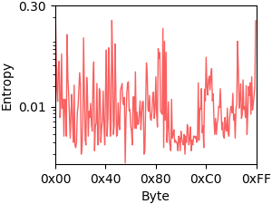

# VulHawk
This is the official repository for VulHawk.

## Get Started
### Prerequisites
- Windows (MacOS and Linux also work)
- Python 3.8.2 (64 bit)
- PyTorch 1.13.1
- CUDA 11.7
- IDA pro 7.5+ (only used for dataset processing)

### Quick Start
- File Environment Identification
```
python 2_FileEnvironmentIdentification.py
```
- Function Embedding Generation
```
python 3_function_embedding_generation.py
```
- Binary Function Similarity Detection
```
python 4_binary_code_search.py
```

---

### Entropy Figure
#### x86-O0


#### arm-O1

 


#### x86-O3




